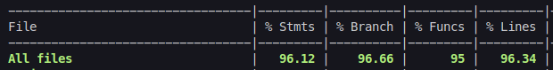

# Delivery App - Birita Go

Essa é uma implementação de uma aplicação fullstack, com uso de React, Node.js com Express.js, e banco de dados MySQL. </br>É um aplicativo de delivery de bebidas que contempla 3 fluxos de uso: fluxo do cliente, do vendedor e do administrador; contando com diversas funcionalidades.

A aplicação foi construída com a arquitetura MSC (model-service-controller) e foi Dockerizada.</br>
Tudo isso com validações e testes pensados para os casos de uso da aplicação, garantindo a qualidade e integridade do código.

O foco dessa projeto foi praticar a construção de uma aplicação fullstack completa robusta, construindo e integrando front e back-end.

[Experimente!](https://react-sql-delivery-app-front.vercel.app)


## Funcionalidades
- Cadastro e login na plataforma
- Redirecionamento no aplicativo de acordo com as credenciais de login (cliente, vendedor ou administrador)
- Validação de token para qualquer operação da aplicação
- Consulta de produtos disponíveis e adição ao carrinho
- Checagem do pedido e remoção de itens do carrinho
- Consulta de vendedores disponíveis e finalização de uma venda
- Consulta de pedidos e seus detalhes
- Acompanhamento e alteração do status do pedido
- Armazenamento dos dados das operações no LocalStorage
- Logout da plataforma
- Registro de novos vendedores pelo administrador
- Consulta e remoção de usuários do sistema pelo administrador


## Documentação

A documentação completa da API, com todas as operações possíveis, pode ser consultada [aqui :)](https://delivery-app-back-b4w6.onrender.com/swagger/), ou localmente em ```http://localhost:3001/swagger/``` após a aplicação estar rodando.


Credenciais de acesso presentes por padrão no banco de dados:

- Cliente
```bash
  email: zebirita@email.com
  senha: $#zebirita#$
```

- Vendedor
```bash
  email: fulana@deliveryapp.com
  senha: fulana@123
```

- Administrador
```bash
  email: adm@deliveryapp.com
  senha: --adm2@21!!--
```

## Demonstração

### Fluxo de usuário


### Fluxo de vendedor


### Fluxo de administrador


## Instalação e execução local

Para rodar esta aplicação é necessário ter o Docker e o Docker Compose (v1.29 ou superior) instalados em sua máquina.

1. Clone o repositório e entre no diretório
```bash
  git clone git@github.com:lzaghi/react-sql-delivery-app.git
  cd react-sql-delivery-app
```

2. A partir da raiz do projeto, acesse /back-end e instale as dependências 
```bash
  cd back-end
  npm install
```

3. A partir da raiz do projeto, acesse /front-end e instale as dependências 
```bash
  cd front-end
  npm install
```

4. A partir da raiz do projeto, suba os containeres do front, back e banco de dados
```bash
  npm run compose:up
```

A aplicação já estará rodando! :)</br>
Acesse ```http://localhost:3000``` para a experiência de usuário. O back-end estará rodando em ```http://localhost:3001```.

5. Para rodar os testes
- front-end: entre no container do front e execute o comando
```bash
  docker exec -it delivery_frontend sh
  npm run test:coverage
```
- back-end: entre no container do back e execute o comando
```bash
  docker exec -it delivery_backend sh
  npm run test:coverage
```

## Cobertura de testes

### Front-end


### Back-end



## Tecnologias utilizadas

React.js, Node.js, Express.js, MySQL, Docker, JWT, RTL, Mocha, Chai, Sinon, Arquitetura MSC, API RESTful, Swagger

O deploy foi feito nas plataformas PlanetScale (banco de dados), Render (back-end) e Vercel (front-end)

## Qualidade de Código

Análise SonarCloud


